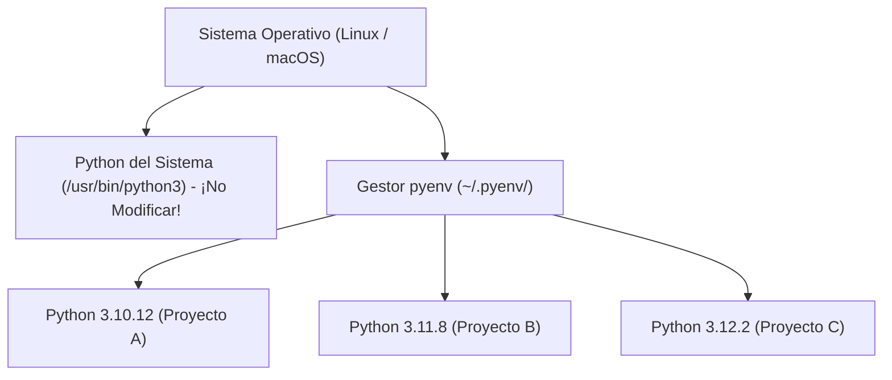

### 1.1 Instalación de una Distribución de Python con pyenv (Installing Python Using pyenv)

En proyectos profesionales de desarrollo de software y Ciencia de Datos, confiar en la versión de Python preinstalada en el sistema operativo (System Python) no es recomendable: puede estar desactualizada, carecer de librerías de desarrollo o causar conflictos si se modifican sus paquetes globales.

La herramienta estándar para instalar y alternar entre múltiples versiones de Python de forma aislada es **`pyenv`**.

---

### 1. Representación Visual del Aislamiento de Versiones



---

### 2. ¿Qué es `pyenv` y por qué utilizarlo?

**`pyenv`** permite:
- Instalar múltiples versiones de Python en el espacio de usuario (sin requerir permisos `sudo`).
- Establecer una versión global por defecto para el usuario.
- Fijar una versión específica de Python por proyecto (`pyenv local 3.10.12`).
- Evitar contaminar la instalación de Python del sistema operativo.

---

### 3. Instalación de `pyenv` en Linux / macOS

#### A. Requisitos previos en Ubuntu / Debian:
Antes de compilar versiones de Python con `pyenv`, instalamos las dependencias del sistema:

```bash
sudo apt update
sudo apt install -y make build-essential libssl-dev zlib1g-dev \
libbz2-dev libreadline-dev libsqlite3-dev wget curl llvm \
libncursesw5-dev xz-utils tk-dev libxml2-dev libxmlsec1-dev libffi-dev liblzma-dev
```

#### B. Ejecutar el Instalador Automático de pyenv:
```bash
curl https://pyenv.run | bash
```

#### C. Configurar las variables de entorno en tu Shell (`~/.bashrc` o `~/.zshrc`):
Agregá las siguientes líneas al final de tu archivo de configuración de terminal:

```bash
export PYENV_ROOT="$HOME/.pyenv"
[[ -d $PYENV_ROOT/bin ]] && export PATH="$PYENV_ROOT/bin:$PATH"
eval "$(pyenv init -)"
```

Reiniciá tu terminal o ejecutá `source ~/.bashrc` para aplicar los cambios.

---

### 4. Comandos Esenciales de `pyenv`

#### Listar versiones disponibles para instalar:
```bash
pyenv install --list | grep " 3.10"
```

#### Instalar una versión específica de Python:
```bash
pyenv install 3.10.12
```

#### Configurar la versión de Python para el proyecto actual:
Navegá al directorio de tu proyecto y ejecutá:

```bash
pyenv local 3.10.12
```

Esto creará un archivo oculto `.python-version` en la raíz del proyecto.

---

### 🛠️ Diagnóstico y Resolución de Errores Comunes (Troubleshooting)

> [!WARNING]
> **Error 1: `bash: pyenv: command not found`**
> - **Causa**: Las variables de entorno no fueron cargadas en la sesión actual de la terminal.
> - **Solución**: Verificá que agregaste las líneas de `export PYENV_ROOT` a tu `~/.bashrc` o `~/.zshrc` y ejecutá `source ~/.bashrc`.

> [!CAUTION]
> **Error 2: `ERROR: The Python ssl extension was not compiled. Missing the OpenSSL lib?`**
> - **Causa**: Faltan las cabeceras de desarrollo de OpenSSL en el sistema operativo antes de compilar Python.
> - **Solución**: Ejecutá `sudo apt install libssl-dev zlib1g-dev` y desinstalá e instalá la versión de nuevo: `pyenv uninstall 3.10.12 && pyenv install 3.10.12`.

---

### 🧪 Micro-Desafío Práctico
1. Verificá qué versiones de Python tenés instaladas ejecutando `pyenv versions`.
2. Creá una carpeta temporal `test-pyenv`, ingresá a ella y fijá la versión `3.10.12` con `pyenv local 3.10.12`.
3. Verificá que la versión activa sea exactamente esa ejecutando `python --version`.
