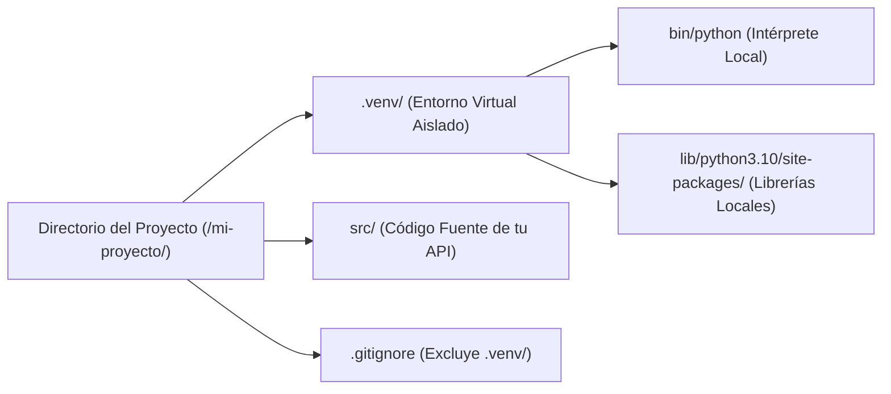

### 1.2 Creación de Entornos Virtuales en Python (Creating a Virtual Environment)

Un **entorno virtual** es una estructura de directorio aislada que contiene una copia independiente del intérprete de Python y su directorio de paquetes de terceros (`site-packages`).

---

### 1. Arquitectura Visual de un Entorno Virtual



---

### 2. ¿Por qué son indispensables los Entornos Virtuales?

Imaginá dos proyectos en el mismo equipo:
- El **Proyecto A** requiere `FastAPI 0.95.0` y `Pydantic 1.10.0`.
- El **Proyecto B** requiere `FastAPI 0.110.0` y `Pydantic 2.6.0`.

Si instalaras los paquetes de forma global, la instalación de un proyecto sobrescribiría las librerías del otro. Los entornos virtuales resuelven este conflicto aislando las dependencias.

---

### 3. Creación y Activación con `venv`

Python incluye el módulo nativo **`venv`** para la generación de entornos virtuales.

#### Comandos para Crear el Entorno Virtual:
```bash
# Crear el entorno virtual en el directorio oculto .venv
python -m venv .venv
```

#### Activar el Entorno Virtual:

- **En Linux / macOS (Bash / Zsh):**
  ```bash
  source .venv/bin/activate
  ```

- **En Windows (PowerShell):**
  ```powershell
  .venv\Scripts\Activate.ps1
  ```

#### Indicador en la Terminal:
Una vez activado, el prompt de tu terminal mostrará el nombre del entorno al inicio:
```text
(.venv) usuario@equipo:~/mi-proyecto$
```

---

### 4. Desactivación e Ignorado en Git (`.gitignore`)

#### Desactivar el Entorno Virtual:
```bash
deactivate
```

#### Ignorar el Entorno Virtual en Git:
**¡Regla de Oro!**: Jamás se debe subir la carpeta `.venv` al repositorio Git. Agregá la carpeta a tu archivo `.gitignore`:

```text
# Archivo .gitignore
.venv/
__pycache__/
*.pyc
```

---

### 🛠️ Diagnóstico y Resolución de Errores Comunes (Troubleshooting)

> [!WARNING]
> **Error 1: `bash: .venv/bin/activate: No such file or directory`**
> - **Causa**: Intentaste activar el entorno sin haber ejecutado primero el comando de creación `python -m venv .venv`.
> - **Solución**: Verificá que estás ubicado en la raíz del proyecto y ejecutá `python -m venv .venv` antes de activar.

> [!CAUTION]
> **Error 2: PowerShell bloquea la activación en Windows (`cannot be loaded because running scripts is disabled`)**
> - **Causa**: Política de ejecución de scripts de Windows restringida por defecto.
> - **Solución**: Abrí PowerShell como Administrador y ejecutá: `Set-ExecutionPolicy Unrestricted -Scope Process`.

---

### 🧪 Micro-Desafío Práctico
1. En tu terminal, ejecutá `which python` antes de activar el entorno virtual.
2. Activá el entorno virtual con `source .venv/bin/activate` y volvé a ejecutar `which python`.
3. Comprobá que la ruta del ejecutable ahora apunte a la carpeta `.venv/bin/python`.
