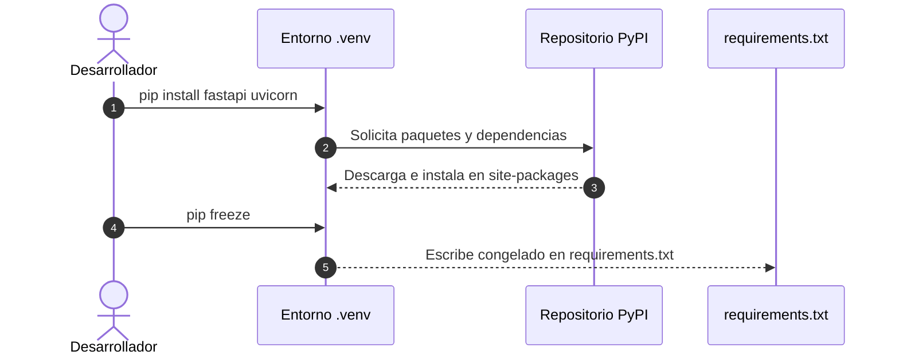

### 1.3 Instalación de Paquetes con pip (Installing Python Packages with pip)

**`pip`** es el gestor de paquetes oficial de Python. Se conecta con el repositorio público **PyPI** (Python Package Index) para descargar e instalar librerías de terceros en tu entorno virtual.

---

### 1. Flujo de Gestión de Paquetes



---

### 2. Instalación de Paquetes Básica

Asegúrate de tener tu entorno virtual activo (`source .venv/bin/activate`) antes de instalar librerías.

#### Instalar un Paquete:
```bash
pip install fastapi
```

#### Instalar Múltiples Paquetes Simultáneamente:
```bash
pip install "fastapi[all]" uvicorn pydantic
```

#### Actualizar `pip` a la Última Versión:
```bash
python -m pip install --upgrade pip
```

---

### 3. Archivos de Requisitos (`requirements.txt`)

Para que otros desarrolladores o el servidor de producción puedan replicar exactamente el mismo entorno, documentamos las dependencias en un archivo denominado **`requirements.txt`**.

#### Congelar las Dependencias Actuales:
```bash
pip freeze > requirements.txt
```

#### Ejemplo de Contenido de `requirements.txt`:
```text
fastapi==0.110.0
uvicorn==0.28.0
pydantic==2.6.4
```

#### Instalar Dependencias desde `requirements.txt`:
```bash
pip install -r requirements.txt
```

---

### 4. Operadores de Versionado en `pip`

| Operador | Ejemplo | Significado |
| :--- | :--- | :--- |
| **`==`** | `fastapi==0.110.0` | Versión exacta fija. |
| **`>=`** | `pydantic>=2.0.0` | Cualquier versión mayor o igual. |
| **`~=`** | `uvicorn~=0.28.0` | Compatible con la versión (acepta `0.28.1`, rechaza `0.29.0`). |

---

### 🛠️ Diagnóstico y Resolución de Errores Comunes (Troubleshooting)

> [!WARNING]
> **Error 1: Instalaste paquetes pero no se encuentran al ejecutar el script**
> - **Causa**: Ejecutaste `pip install` sin haber activado previamente el entorno virtual `.venv`, instalando los paquetes en el Python global del usuario.
> - **Solución**: Verificá que el prompt de tu consola muestre `(.venv)`, ejecutá `pip list` para auditar y volvé a instalar.

> [!CAUTION]
> **Error 2: `ERROR: Could not find a version that satisfies the requirement`**
> - **Causa**: Escribiste mal el nombre del paquete o tu versión de `pip` está desactualizada.
> - **Solución**: Ejecutá `python -m pip install --upgrade pip` e intentá de nuevo.

---

### 🧪 Micro-Desafío Práctico
1. Activá tu entorno virtual `.venv`.
2. Instalá el paquete `httpx` con el comando `pip install httpx`.
3. Ejecutá `pip freeze` en tu consola y verificá que `httpx` aparezca en el listado.
