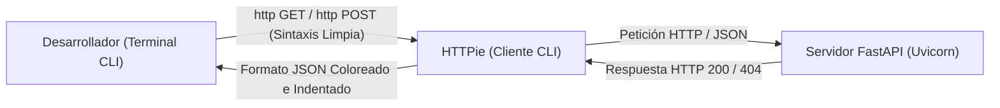

### 1.4 Instalación de la Utilidad HTTPie (Installing HTTPie)

Durante el desarrollo de APIs RESTful con FastAPI, es fundamental contar con un cliente HTTP ágil en la línea de comandos para realizar pruebas rápidas sin depender de un navegador web.

**HTTPie** (`http` / `https`) es un cliente de consola moderno, legible y con coloreado sintáctico automático diseñado específicamente para desarrolladores.

---

### 1. Modelo Mental de Pruebas de APIs con HTTPie



> **¿Por qué aprendemos HTTPie ahora?**
> A partir del **Capítulo 3**, ejecutaremos nuestro servidor de API localmente. HTTPie será nuestra herramienta principal de consola para enviar datos, probar autenticación y auditar respuestas al instante.

---

### 2. ¿Por qué HTTPie frente a `curl`?

A diferencia del comando tradicional `curl`, **HTTPie**:
- Formatea e indenta automáticamente las respuestas JSON devueltas por la API.
- Aplica resaltado de sintaxis con colores en la terminal.
- Envía payloads JSON mediante una sintaxis limpia y natural (`clave=valor` o `clave:=numero`).
- Simplifica el envío de cabeceras HTTP y datos de formulario.

---

### 3. Instalación de HTTPie

Podemos instalar HTTPie directamente mediante `pip` dentro de nuestro entorno virtual o utilizando el gestor de paquetes del sistema operativo:

#### Opción A: Instalación vía `pip` (Recomendado en el entorno virtual):
```bash
pip install httpie
```

#### Opción B: Instalación vía `apt` (Ubuntu / Debian):
```bash
sudo apt update && sudo apt install -y httpie
```

---

### 4. Ejemplos de Uso de HTTPie

El comando ejecutable en la terminal es **`http`**:

#### A. Petición GET simple a una API pública de prueba:
```bash
http GET https://httpbin.org/get
```

#### B. Petición POST enviando un Payload JSON:
HTTPie convierte los pares `clave=valor` automáticamente a formato JSON:

```bash
http POST https://httpbin.org/post \
    nombre="Sensor_Temperatura" \
    valor:=42.5 \
    activo:=true
```

---

### 🛠️ Diagnóstico y Resolución de Errores Comunes (Troubleshooting)

> [!WARNING]
> **Error 1: `http: Connection refused`**
> - **Causa**: Intentaste realizar una petición a un servidor local (ej. `http://127.0.0.1:8000`) sin que el servidor de FastAPI esté ejecutándose en otra consola.
> - **Solución**: Asegurate de iniciar la API con Uvicorn antes de enviar la petición. Para probar tu instalación sin un servidor local, ejecutá `http GET https://httpbin.org/get`.

> [!CAUTION]
> **Error 2: Sintaxis de números y booleanos en HTTPie**
> - **Causa**: Usar `=` en lugar de `:=` envía los datos como cadenas de texto (`str`) en lugar de números o booleanos en el JSON.
> - **Solución**: Usá `=` para texto (`nombre="Torno"`) y `:=` para datos no textuales (`puerto:=8000` o `activo:=true`).

---

### 🧪 Micro-Desafío Práctico
1. Verificá que HTTPie esté instalado ejecutando `http --version`.
2. Enviá una petición GET de prueba a `https://httpbin.org/headers` desde tu terminal.
3. Observá cómo HTTPie resalta los colores y formatea las cabeceras JSON devueltas.
