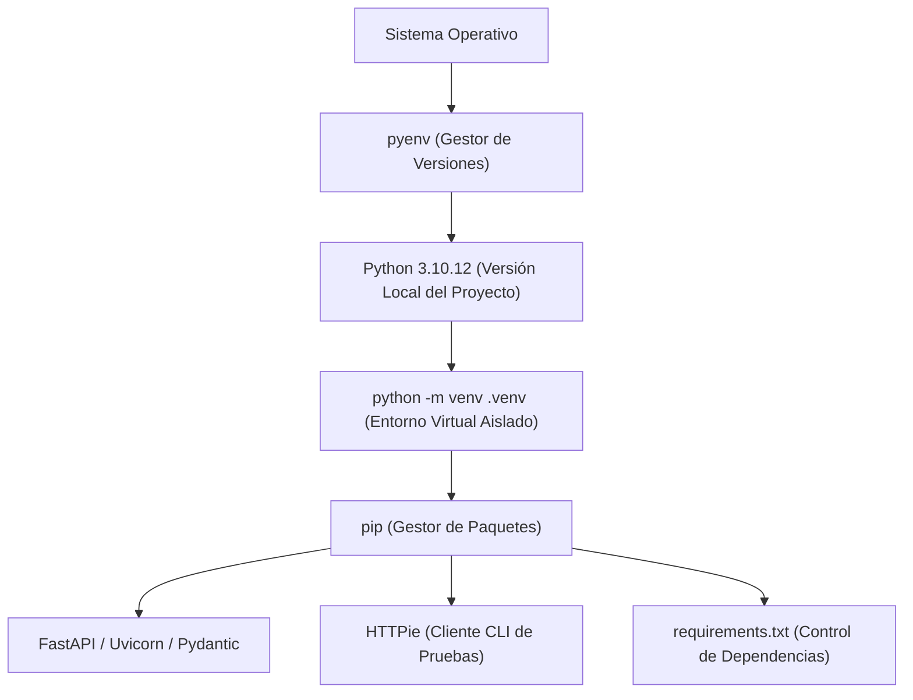

### 1.5 Resumen Integrador del Capítulo 1 (Chapter Summary)

En este primer capítulo configuraste el entorno de desarrollo profesional e interactivo necesario para construir aplicaciones web y servicios de Ciencia de Datos en Python.

---

### 🗺️ Mapa Integrador del Entorno de Desarrollo

---

### 📋 Checklist de Conceptos y Habilidades Dominadas

| Lección | Conceptos Clave | Herramientas Utilizadas |
| :--- | :--- | :--- |
| **1.1 Instalación con pyenv** | Gestión aislada de múltiples versiones de Python por proyecto sin alterar el Python del sistema operativo. | `pyenv`, `.python-version` |
| **1.2 Entornos Virtuales** | Aislamiento de librerías y dependencias por proyecto mediante entornos virtuales. | `python -m venv`, `source .venv/bin/activate` |
| **1.3 Gestión con pip** | Instalación de paquetes desde PyPI y congelado de dependencias reproducibles en `requirements.txt`. | `pip install`, `pip freeze` |
| **1.4 Cliente HTTPie** | Pruebas de endpoints HTTP en consola con JSON coloreado e inspección de cabeceras. | `http`, `HTTPie` |

---

### 🧪 Micro-Desafío Integrador del Capítulo 1

Para confirmar que tu entorno está listo para avanzar al **Capítulo 2**, ejecutá los siguientes pasos en tu consola:

1. Verificá que la versión activa sea Python 3.10+ ejecutando `python --version`.
2. Verificá que tu entorno virtual esté activo ejecutando `which python` (debe apuntar a `.venv/bin/python`).
3. Comprobá que tenés `HTTPie` instalado en el entorno ejecutando `http --version`.

---

### 🚀 Próximos Pasos

Has completado con éxito la configuración del entorno en el **Capítulo 1**. En el **Capítulo 2 (Especificidades de la Programación en Python)** repasaremos las sintaxis avanzadas de Python que alimentan la magia de FastAPI: list comprehensions, generadores con `yield`, POO y Type Hints con `mypy`.
