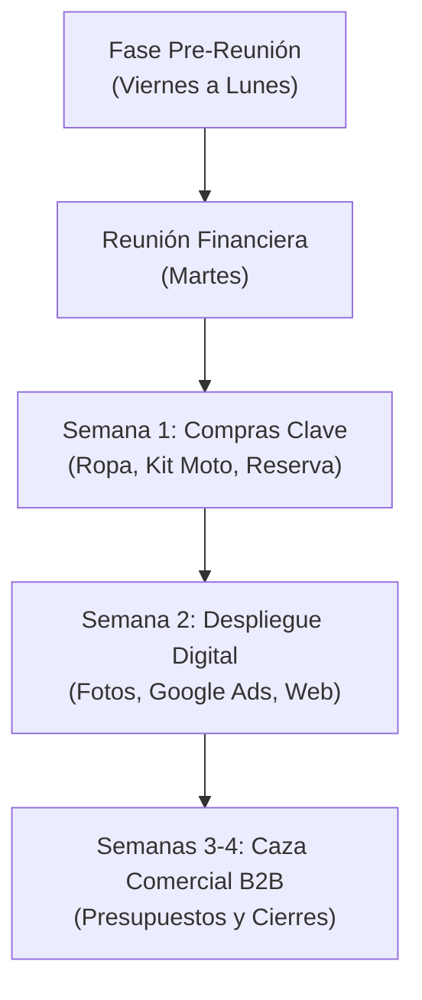

# 03 — Plan de Acción y Tareas Paso a Paso

> **Fecha:** 14 de Agosto de 2026  
> **Área:** Operaciones y Comercial / Grupo DataMaq  
> **Objetivo:** Hoja de ruta cronológica para la obtención del préstamo y ejecución estratégica de los fondos.

---

## 📅 Cronograma y Checklist de Tareas

---

### 🟢 FASE 0: Preparación Pre-Reunión (Viernes 14 a Lunes 17)

- [ ] **Documentación Personal:**
  - [ ] Descargar los últimos 3 a 6 recibos de sueldo de la relación de dependencia.
  - [ ] Constancia de CBU y DNI vigente.
  - [ ] Constancia de inscripción de Monotributo.
- [ ] **Definición de Límites Financieros:**
  - [ ] Calcular la cuota mensual máxima que tu sueldo fijo puede absorber con tranquilidad (regla: no superar el 25-30% de tu sueldo neto).
  - [ ] Llevar anotados los 3 montos objetivo:
    - *Piso:* $1.000.000 ARS (Escenario A)
    - *Ideal:* $2.200.000 ARS (Escenario B)
    - *Techo:* $3.500.000 ARS (Escenario C con GPU)
- [ ] **Preguntas clave para hacer en la reunión:**
  - [ ] ¿Cuál es el Costo Financiero Total (CFT) efectivo anual?
  - [ ] ¿El sistema de amortización es Francés (cuota fija en pesos)?
  - [ ] ¿Existe penalización o comisión por cancelación anticipada total o parcial?

---

### 🟡 FASE 1: Compras de Prioridad 1 y Resguardo (Semana 1 Post-Desembolso)

- [ ] **Resguardo Financiero Inmediato:**
  - [ ] Transferir el 25% del capital del préstamo a una cuenta remunerada / FCI Money Market para fondear las primeras cuotas del crédito y contar con liquidez para materiales.
- [ ] **Branding Presencial & Seguridad:**
  - [ ] Comprar 3 chombas técnicas y 2 pantalones cargo antidesgarro.
  - [ ] Enviar a bordar el logo de **DataMaq** en pecho y espalda.
  - [ ] Adquirir el calzado de seguridad dieléctrico normalizado.
  - [ ] Comprar mochila técnica porta-notebook e instrumental para moto.
  - [ ] Encargar ploteo reflectivo para el baúl de la moto con el logo DataMaq.
- [ ] **Material Impreso:**
  - [ ] Mandar a imprimir 100 tarjetas personales con código QR.
  - [ ] Imprimir 50 carpetas/dossiers de presentación de servicios de submedición y eficiencia energética.

---

### 🔵 FASE 2: Despliegue Digital y Captación Comercial (Semanas 2 y 3)

- [ ] **Producción de Contenido Visual Real:**
  - [ ] Tomar fotografías de calidad con la nueva indumentaria institucional puesta, junto al instrumental técnico y la moto con su baúl ploteado.
- [ ] **Optimización de Presencia Digital:**
  - [ ] Subir las fotos al perfil de **Google Business Profile (Google Maps)** y completar horario de atención, servicios y zona de cobertura (Zona Norte AMBA).
  - [ ] Ajustar la landing page de `datamaq.com.ar` con las fichas de Submedición de Energía y botón directo a WhatsApp Business.
- [ ] **Lanzamiento de Google Ads:**
  - [ ] Configurar campaña de búsqueda en Google Ads segmentada geográficamente a: Pilar, Campana, Escobar, Tigre, San Martín, San Isidro y Vicente López.
  - [ ] Activar palabras clave exactas y de frase: *"medidores de energía para industrias"*, *"submedición eléctrica consorcios"*, *"mantenimiento electrónico industrial"*, *"medición puesta a tierra con protocolo SRT"*.
  - [ ] Establecer un límite diario de gasto controlado.

---

### 🟣 FASE 3: Ejecución Comercial y Recupero del Capital (Mes 1 en adelante)

- [ ] **Prospección y Salidas a Terreno:**
  - [ ] Visitar administraciones de consorcios y centros comerciales de Zona Norte ofreciendo el relevamiento para submedición de consumo.
  - [ ] Contactar por LinkedIn a Jefes de Planta y Mantenimiento de parques industriales de Pilar y Campana.
- [ ] **Monitoreo de Conversión y Finanzas:**
  - [ ] Registrar cada contacto recibido por WhatsApp o llamada y medir el costo por lead de Google Ads.
  - [ ] Facturar los primeros contratos y reponer el fondo de maniobra para cancelar cuotas del préstamo anticipadamente si el margen lo permite.
